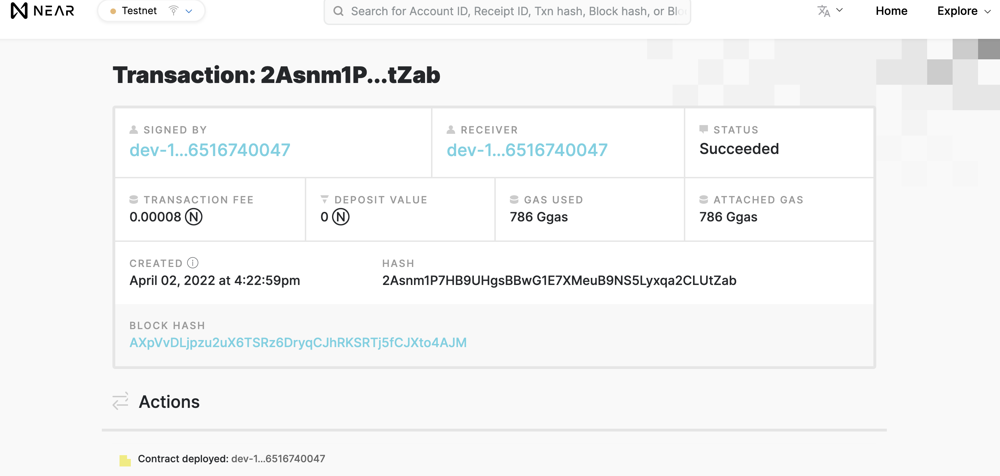
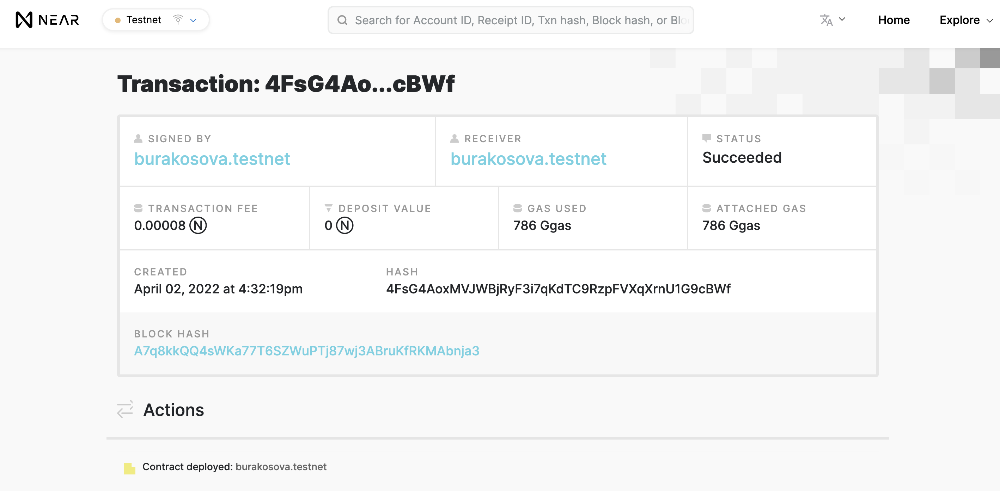

# near-contract

Deploying a simple contract to near blockchain (testnet)

Firt clone this repo:  
`git clone https://github.com/Learn-NEAR/starter--near-sdk-as `

Use `yarn` or `npm install` command to download dependencies

Then run `yarn build:release`

`near dev-deploy ./build/release/simple.wasm`

Login to your testnet account using ` near login` command

Finally deploy it:
`near deploy --accountId burakosova.testnet --wasmFile ./build/release/simple.wasm`

Resource: https://hackmd.io/@d3mage/prepare-for-ncd

